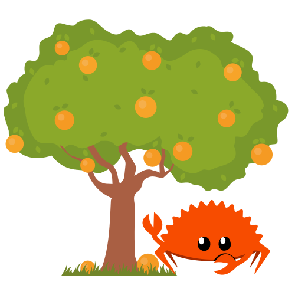

# orange-trees

<p align="center">
  
</p>

<p align="center">~ A tree data structure implementation in Rust ~</p>

<p align="center">Developed by <a href="https://veeso.me/" target="_blank">@veeso</a></p>
<p align="center">Current version: 0.1.1 (09/06/2021)</p>

<p align="center">
  <a href="https://opensource.org/licenses/MIT"
    ></a>
  <a href="https://github.com/veeso/orange-trees/stargazers"
    ></a>
  <a href="https://crates.io/crates/orange-trees"
    ></a>
  <a href="https://crates.io/crates/orange-trees"
    ></a>
  <a href="https://ko-fi.com/veeso">
    </a>
</p>
<p align="center">
  <a href="https://github.com/veeso/orange-trees/actions/workflows/ci.yml"
    ></a>
  <a href="https://coveralls.io/github/veeso/orange-trees"
    ></a>
  <a href="https://docs.rs/orange-trees"
    ></a>
</p>

---

- [orange-trees](#orange-trees)
  - [About orange-trees 🍊](#about-orange-trees-)
  - [Get started 🏁](#get-started-)
    - [Add orange-trees to your Cargo.toml 🦀](#add-orange-trees-to-your-cargotoml-)
    - [Examples](#examples)
  - [Contributing and issues 🤝🏻](#contributing-and-issues-)
  - [Changelog ⏳](#changelog-)
  - [License 📃](#license-)

---

## About orange-trees 🍊

> Flowers in my hair, I belong by the sea  
> Where we used to be, sitting by the orange trees  
> ~ Orange Trees - Marina ~

orange-trees is an implementation of the **Tree** data structure. It comes with a rich set of methods to manipulate and query nodes.
In orange-trees each Tree is represented by a *Node*, where each Node has a **Key**, which identify the node, a **Value** and a list of children, which are nodes too.
Key and value are defined by the user, since they are generics.

```rust
#[macro_use]
extern crate orange_trees;

use orange_trees::{Tree, Node};

// Create a tree using macro
let tree: Tree<&'static str, &'static str> = Tree::new(
  node!("/", "/"
    , node!("/bin", "bin/"
      , node!("/bin/ls", "ls")
      , node!("/bin/pwd", "pwd")
    )
    , node!("/tmp", "tmp/"
      , node!("/tmp/dump.txt", "dump.txt")
      , node!("/tmp/omar.txt", "omar.txt")
    )
  )
);

// Create a tree using constructor
let tree: Tree<&'static str, &'static str> = Tree::new(
  Node::new("/", "/")
    .with_child(
      Node::new("/bin", "bin/")
        .with_child(Node::new("/bin/ls", "ls"))
        .with_child(Node::new("/bin/pwd", "pwd"))
      )
    .with_child(
      Node::new("/tmp", "tmp/")
        .with_child(Node::new("/tmp/dump.txt", "dump.txt"))
        .with_child(Node::new("/tmp/omar.txt", "omar.txt"))
        .with_child(
          Node::new("/tmp/.cache", "cache/")
            .with_child(Node::new("/tmp/.cache/xyz.cache", "xyz.cache"))
        )
    ),
);
```

---

## Get started 🏁

### Add orange-trees to your Cargo.toml 🦀

```toml
orange-trees = "0.1.0"
```

### Examples

Examples can be found in the homepage of the documentation at <https://docs.rs/orange-trees>

---

## Contributing and issues 🤝🏻

Contributions, bug reports, new features and questions are welcome! 😉
If you have any question or concern, or you want to suggest a new feature, or you want just want to improve orange-trees, feel free to open an issue or a PR.

Please follow [our contributing guidelines](CONTRIBUTING.md)

---

## Changelog ⏳

View orange-trees's changelog [HERE](CHANGELOG.md)

---

## License 📃

orange-trees is licensed under the MIT license.

You can read the entire license [HERE](LICENSE)
